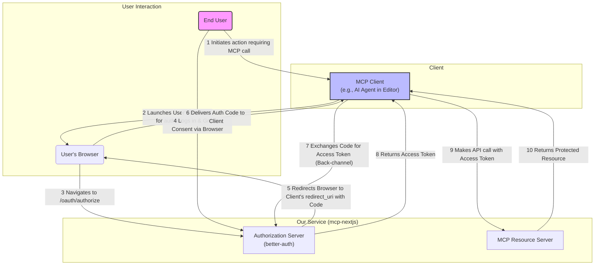
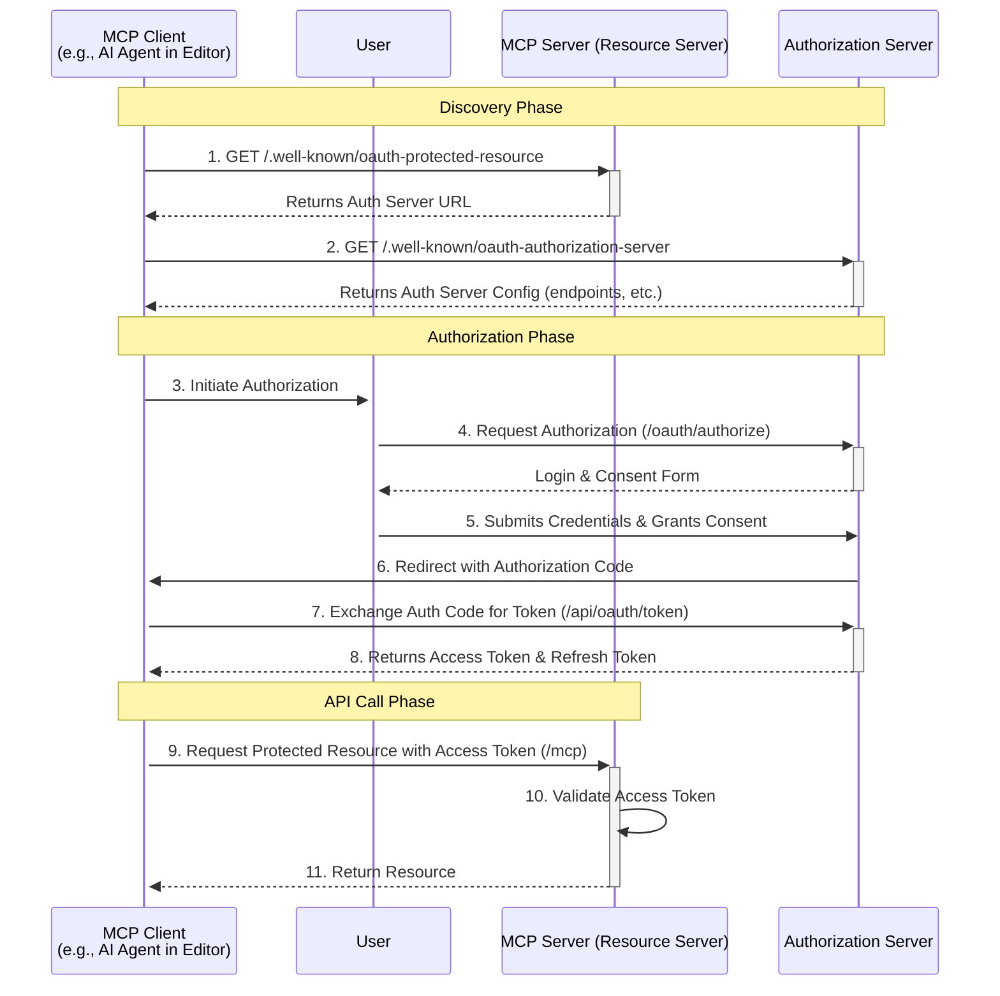
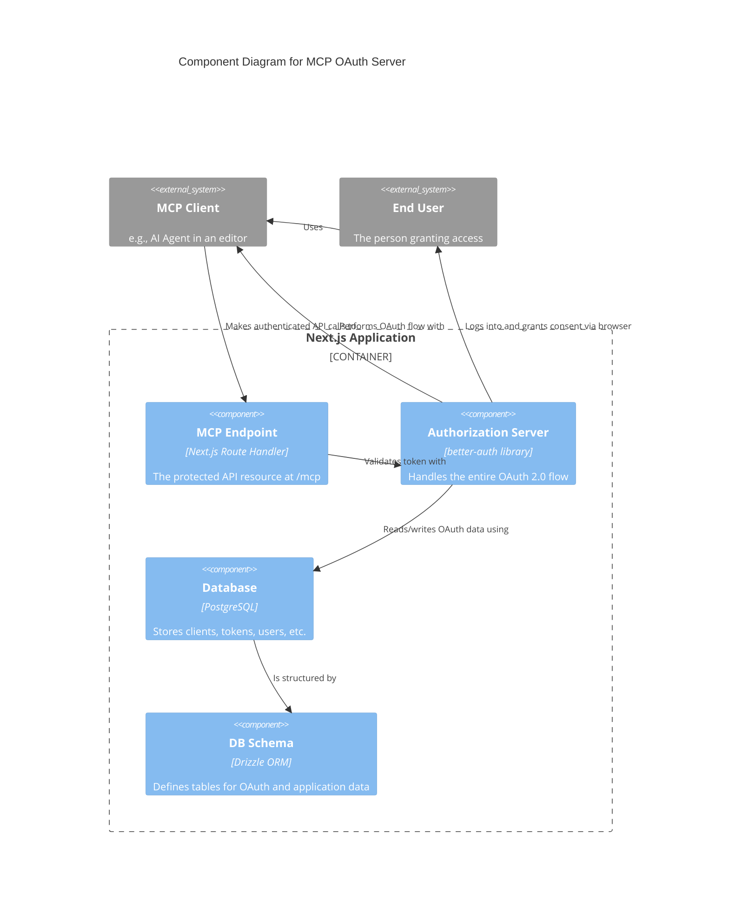

# A Developer's Guide to MCP OAuth in this Project

Welcome! This guide is for developers who are familiar with the Model Context Protocol (MCP) but need to understand how to secure an MCP server using OAuth 2.0. We'll cover the "why," the "how," and show you how to customize the implementation in this project.

This project primarily uses the **Authorization Code Grant** flow, which is the industry standard for securely authenticating users in third-party applications.

## 1. The "Why": Securing Your MCP Server

Think of your MCP server as a powerful API that exposes tools for AI models. You wouldn't want just anyone to be able to use these tools. While simple API keys might seem sufficient for basic server protection, the MCP context introduces a critical requirement: **acting on behalf of a user**. This is where OAuth 2.0 becomes essential.

### Why Not Just API Keys or Simple JWTs?

It's a fair question. Simpler authentication methods are often faster to implement, so why choose the complexity of OAuth?

* **API Keys are for *Clients*, Not *Users***: An API key tells your server *which application* is making a request (e.g., the "VS Code AI Agent"). It doesn't tell you *which user* is sitting in front of VS Code. For MCP, you almost always need to know who the user is to access their specific data or perform actions on their behalf.

* **The Problem of Delegation**: The core of the challenge is *delegated authority*. An MCP client (like an AI agent) needs to prove that a specific user has given it permission to access the MCP server. An API key can't do this. A simple JWT issued by the client also doesn't work, as the client can't be trusted to assert a user's identity without proof.

  > **An Analogy**: Think of OAuth like a hotel key card system. You (the user) show your ID to the receptionist (the Authorization Server) once. The receptionist gives you a key card (the Access Token) that only works for your room (scopes) and for a limited time. You can give this key card to a cleaning service (the MCP Client) to access your room, but you would never give them your actual ID.

* **Security and User Trust**: With API keys, the key is often a long-lived, static secret. If leaked, it's a significant security risk. More importantly, asking a user to paste a sensitive API key into a client application is poor security practice and erodes trust.

### The Core Benefits of OAuth 2.0 for MCP

OAuth 2.0 is the industry standard specifically designed to solve the problem of delegated authority. It provides a secure, user-centric, and standardized framework.

1. **Secure User-Delegated Access**: This is the cornerstone. The user logs in directly with the Authorization Server (our service), not the MCP client. They grant permission without ever sharing their credentials (like a password) with the client application. The client receives a temporary **Access Token** as proof of this permission.

2. **User Consent is Built-in**: The OAuth flow includes a user-facing consent screen. This is vital for transparency. The user sees exactly what permissions (scopes) the AI agent is requesting (e.g., "read your files," "access your calendar") and can explicitly approve or deny the request.

3. **Granular Permissions with Scopes**: OAuth provides a standard way to define and request fine-grained permissions. You can define scopes like `mcp:tools:readonly` or `mcp:tools:execute`. The client requests only the scopes it needs, and the MCP server can enforce these permissions, adhering to the principle of least privilege.

4. **Improved Security Posture**: Access tokens are typically short-lived, minimizing the damage if one is leaked. **Refresh Tokens** can be used to obtain new access tokens without requiring the user to log in repeatedly, balancing security with a smooth user experience.

In short, while OAuth 2.0 has more moving parts, it provides the correct and secure foundation for an ecosystem where third-party clients act on behalf of users—the exact model of MCP.

## 2. The OAuth Flow: From Request to MCP Access

Here’s a step-by-step breakdown of how a client application gets access to the MCP server using the **Authorization Code Grant** flow.

### Phase 1: Discovery (The Handshake)

Before anything else, the client application needs to know *how* to talk to our security guard (the Authorization Server). Instead of hardcoding URLs, it uses a standard discovery process.

1. **Client to MCP Server**: "I want to access your resources. Who is your security guard (Authorization Server)?"
    * It does this by asking `/.well-known/oauth-protected-resource`.
2. **Client to Authorization Server**: "Hello, security guard. How do I work with you? Where do I send users to log in? Where do I exchange codes for tokens?"
    * It asks this by querying the Authorization Server's `/.well-known/oauth-authorization-server` endpoint.

This automated discovery makes it much easier for developers to integrate with our MCP server.

### Phase 2: Authorization (Getting the Code)

Now that the client knows the rules, it can ask the user for permission.

1. **Client Redirects User**: The client sends the user to our server's `/oauth/authorize` page.
2. **User Login & Consent**: If not already logged in, the user authenticates (e.g., with Google, GitHub, or email). They are then shown a consent screen saying, "This application wants to access your data. Do you approve?"
3. **Receive Authorization Code**: Upon approval, our server sends the user back to the client's registered `redirect_uri` with a temporary **Authorization Code**.

### Phase 3: Token Exchange & API Call (The Payoff)

The authorization code isn't the final key. The client's backend must exchange it for the real key.

1. **Client Exchanges Code for Token**: The client's server makes a secure, backend `POST` request to our `/api/oauth/token` endpoint, sending the authorization code along with its own `client_id` and `client_secret`.
2. **Receive Access Token**: Our server validates everything and, if correct, issues an **Access Token** (and a **Refresh Token**).
3. **Access MCP Server**: The client can now finally make requests to the protected `/mcp/[transport]` endpoint, including the access token in the `Authorization: Bearer <token>` header. Our MCP server validates this token on every request before processing it.

## 3. Implementation: Under the Hood

This project uses the excellent `better-auth` library to handle the heavy lifting of being an Authorization Server.

| Component | Path | Responsibilities |
| :--- | :--- | :--- |
| **Authorization Server Core** | `src/lib/auth.ts` | Configured instance of `better-auth`. Manages the entire OAuth 2.0 flow, including social logins. |
| **Client Registration** | `src/app/api/oauth/register/route.ts` | An endpoint for developers to register their client applications and receive a `client_id` and `client_secret`. |
| **Authorization Endpoint (UI)** | `src/app/oauth/authorize/page.tsx` | The user-facing React Server Component where the user grants or denies access. |
| **Token Endpoint (API)** | `src/app/api/oauth/token/route.ts` | The API endpoint where clients exchange authorization codes for access tokens. `better-auth` handles the logic. |
| **Resource Server (MCP)** | `src/app/mcp/[transport]/route.ts` | The protected MCP endpoint. It uses a middleware-like function to validate the `Authorization: Bearer` token before allowing access. |
| **OAuth Discovery** | `src/app/.well-known/*` | Implements standard discovery endpoints so client applications can automatically configure themselves. |
| **Database Schema** | `src/lib/db/schema.ts` | Defines the database tables (`clients`, `authCodes`, `accessTokens`, etc.) used by `better-auth` to store all OAuth-related data. |

### Protecting the MCP Endpoint

Here is a simplified example of how the MCP route handler in `src/app/mcp/[transport]/route.ts` protects the resource:

```typescript
// src/app/mcp/[transport]/route.ts (Illustrative)
import { db } from '@/lib/db';
import { accessTokens } from '@/lib/db/schema';
import { eq } from 'drizzle-orm';

async function authenticateRequest(request: Request) {
  const authHeader = request.headers.get('Authorization');
  if (!authHeader || !authHeader.startsWith('Bearer ')) {
    return null; // No token
  }
  const token = authHeader.substring(7);

  // Find the token in the database
  const tokenRecord = await db.query.accessTokens.findFirst({
    where: eq(accessTokens.token, token),
    with: { user: true }, // Join with user table
  });

  // Check if token exists and is not expired
  if (!tokenRecord || tokenRecord.expiresAt < new Date()) {
    return null; // Invalid or expired token
  }

  return tokenRecord.user; // Success! Return the user.
}

export async function POST(request: Request) {
  const user = await authenticateRequest(request);
  if (!user) {
    return new Response('Unauthorized', { status: 401 });
  }

  // User is authenticated, proceed with MCP logic...
  // You can now use the `user` object.
}
```

## 4. How to Customize and Extend

This project is a template. Here’s how you can adapt it to your needs.

### Adding New Authentication Methods (Social Logins)

Adding a new way for users to log in (e.g., Twitter/X, Microsoft) is straightforward because `better-auth` handles it.

1. **Get Credentials**: Go to the provider's developer portal and get a Client ID and Client Secret for your application.
2. **Set Environment Variables**: Add the credentials to your `.env.local` file.

    ```bash
    # .env.local
    TWITTER_CLIENT_ID="your-twitter-client-id"
    TWITTER_CLIENT_SECRET="your-twitter-client-secret"
    ```

3. **Update `auth.ts`**: Add the new provider to the `socialProviders` configuration in `src/lib/auth.ts`.

    ```typescript
    // src/lib/auth.ts
    // ... existing code ...
    export const auth = betterAuth({
      // ... existing code ...
      socialProviders: {
        google: { /* ... */ },
        github: { /* ... */ },
        discord: { /* ... */ },
        // Add your new provider here
        twitter: {
          clientId: process.env.TWITTER_CLIENT_ID!,
          clientSecret: process.env.TWITTER_CLIENT_SECRET!,
        },
      },
      // ... existing code ...
    });
    ```

That's it! `better-auth` will automatically handle the rest.

### Customizing the Consent Screen

The consent screen at `/oauth/authorize` is a React Server Component located at `src/app/oauth/authorize/page.tsx`. You can edit this file just like any other Next.js page to match your brand and style.

### Defining and Using Scopes

If you want to offer more granular permissions for your MCP tools (e.g., `read:contacts` or `write:calendar`), you need to define and manage scopes.

**1. Define Your Scopes:**
First, decide on a list of scopes you want to support. For example:

* `mcp:tools:read`: Allows listing available tools.
* `mcp:tools:execute`: Allows executing tools.
* `profile:read`: Allows reading the user's profile.

**2. Update the Consent Screen (`/oauth/authorize`):**
Modify the `page.tsx` to display the scopes requested by the client. The requested scopes will be available in the search parameters.

```tsx
// src/app/oauth/authorize/page.tsx (Illustrative)
export default function AuthorizePage({ searchParams }: {
  searchParams: { client_id: string; scope: string; /* ...other params */ }
}) {
  const requestedScopes = searchParams.scope?.split(' ') || [];

  return (
    <div>
      <h1>Grant Access to {searchParams.client_id}</h1>
      <p>This application wants to access the following permissions:</p>
      <ul>
        {requestedScopes.map(scope => <li key={scope}>{scope}</li>)}
      </ul>
      {/* Form with "Approve" and "Deny" buttons */}
    </div>
  );
}
```

**3. Store Granted Scopes:**
When the user approves, the `better-auth` library will automatically store the granted scopes alongside the access token in the database.

**4. Enforce Scopes at the MCP Endpoint:**
In your MCP route handler, after authenticating the token, check that it has the required scope for the requested action.

```typescript
// src/app/mcp/[transport]/route.ts (Illustrative)
async function authenticateRequest(request: Request, requiredScope: string) {
  // ... (previous authentication logic) ...
  const tokenRecord = await db.query.accessTokens.findFirst({ /* ... */ });

  if (!tokenRecord || tokenRecord.expiresAt < new Date()) {
    return null;
  }

  const grantedScopes = tokenRecord.scopes || [];
  if (!grantedScopes.includes(requiredScope)) {
    // User is authenticated, but doesn't have the right permission
    return { error: 'insufficient_scope' };
  }

  return { user: tokenRecord.user };
}

export async function POST(request: Request) {
  const { user, error } = await authenticateRequest(request, 'mcp:tools:execute');

  if (error === 'insufficient_scope') {
    return new Response('Forbidden: Insufficient scope', { status: 403 });
  }
  if (!user) {
    return new Response('Unauthorized', { status: 401 });
  }

  // User is authenticated and has the correct scope, proceed...
}
```

### Other Important Customizations

* **Token Lifespan**: To change how long access tokens or refresh tokens last, you can pass configuration options to `betterAuth` in `src/lib/auth.ts`. Refer to the `better-auth` documentation for specific options like `accessTokenExpiresIn` or `refreshTokenExpiresIn`.

## 5. Advanced Topics & Security Best Practices

### Refresh Token Rotation

This project is configured to use **Refresh Token Rotation**. When a client uses a refresh token to get a new access token, the server invalidates the used refresh token and issues a *new* refresh token. This is a critical security feature that helps detect if a refresh token has been stolen and used by an attacker.

### Public vs. Confidential Clients

OAuth defines two types of clients:

* **Confidential Clients**: Can keep a secret. These are typically backend web servers (like our Next.js app). They use their `client_id` and `client_secret` to exchange the authorization code for a token.
* **Public Clients**: Cannot keep a secret. These are applications running entirely in a browser (SPAs) or on a mobile device. They should **never** be given a `client_secret`.

### PKCE (Proof Key for Code Exchange)

To secure public clients, OAuth introduces **PKCE** (pronounced "pixie"). It's a mechanism that prevents an attacker from intercepting the authorization code and using it. `better-auth` supports PKCE out of the box, making it possible to securely support public clients. If you are building a native app or SPA client, you should ensure it uses the PKCE extension.

## 6. Getting Started: Running & Testing the Flow

To see the OAuth flow in action, you can run the project locally.

1. **Install Dependencies**:

    ```bash
    pnpm install
    ```

2. **Set Up Environment**: Copy `.env.example` to `.env.local` and fill in the required values, especially the database URL and at least one social provider's credentials.
3. **Run Database Migrations**:

    ```bash
    pnpm drizzle:push
    ```

4. **Start the Server**:

    ```bash
    pnpm dev
    ```

You can then use a tool like Postman or `curl` to simulate a client application and test the full OAuth flow from registration to making a protected MCP API call.

## 7. Interaction Flow Diagrams

### Flow Chart



### Sequence Diagram



### Component Interaction Diagram

This diagram shows how the different parts of our Next.js application work together to deliver the OAuth 2.0 and MCP functionality.


