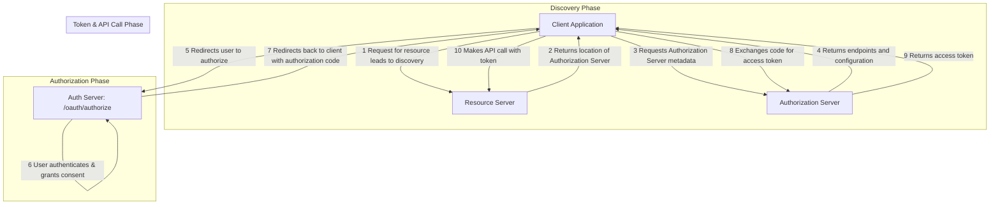
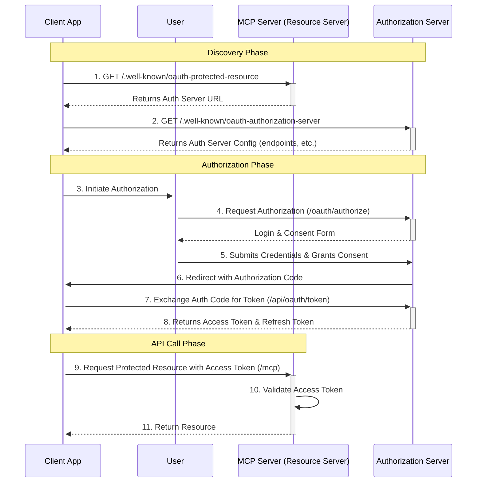

# MCP OAuth Flow in this Project

This document explains the OAuth 2.0 Authorization Code Grant flow implemented in this Next.js project to secure the Model Context Protocol (MCP) server.

## 1. Background: MCP and OAuth 2.0

**Model Context Protocol (MCP)** is a protocol that enables communication between AI models and various tools or services. An MCP server acts as a bridge, exposing tools that a model can interact with.

**OAuth 2.0** is an industry-standard authorization framework. It allows a third-party application (the "Client") to obtain limited access to an HTTP service (the "Resource Server"), either on behalf of a resource owner (the "User") or by itself.

In this project, the **MCP server is the Resource Server**. To protect it from unauthorized access, we use an OAuth 2.0 flow. Any application wanting to use the MCP server (the "Client") must first obtain an access token, which it then includes in its requests to the MCP endpoints.

The specific flow used here is the **Authorization Code Grant**, which is considered highly secure and is suitable for web applications. It involves the following steps:

1. The Client requests authorization from the User.
2. The User authenticates with the Authorization Server and grants permission.
3. The Authorization Server redirects the User back to the Client with an Authorization Code.
4. The Client exchanges the Authorization Code for an Access Token from the Authorization Server.
5. The Client uses the Access Token to make requests to the Resource Server (the MCP server).

## 2. Implementation in this Project

This project uses the `better-auth` library to function as a complete **Authorization Server**. It handles client registration, user authentication, consent, and token issuance. The MCP endpoint acts as the **Resource Server**, validating tokens before processing any requests.

The flow is as follows:

1. **Client Registration**: A developer wanting to use the MCP server first registers their application via the `/api/oauth/register` endpoint. This provides them with a `client_id` and `client_secret`.
2. **Authorization Request**: The client application redirects the user to the `/oauth/authorize` page, passing its `client_id`, `redirect_uri`, `response_type=code`, and requested `scope`.
3. **User Consent**: The user is presented with a consent screen on the `/oauth/authorize` page. If the user is not logged in, they are prompted to do so first. Upon granting permission, `better-auth` generates an authorization code.
4. **Token Exchange**: The user is redirected back to the client's `redirect_uri` with the authorization code. The client's backend then makes a `POST` request to the `/api/oauth/token` endpoint, exchanging the code (along with its `client_id` and `client_secret`) for an access token and a refresh token.
5. **MCP Access**: The client can now make requests to the MCP server at `/mcp/[transport]`, including the obtained access token in the `Authorization` header as a Bearer token.
6. **Token Validation**: The MCP server's `authenticateRequest` function validates the token on every request by checking it against the database. If the token is valid and not expired, the MCP request is processed.

## 3. Key Components and Responsibilities

| Component | Path | Responsibilities |
| :--- | :--- | :--- |
| **Authorization Server** | `src/lib/auth.ts` | Configured instance of `better-auth`. Manages the entire OAuth 2.0 flow. |
| **Client Registration** | `src/app/api/oauth/register/route.ts` | An endpoint for developers to register their client applications and receive credentials. |
| **Authorization Endpoint** | `src/app/oauth/authorize/page.tsx` | The user-facing page where the user grants or denies the client's request for access. |
| **Token Endpoint** | `src/app/api/oauth/token/route.ts` | The endpoint where clients exchange authorization codes for access tokens. |
| **Resource Server (MCP)** | `src/app/mcp/[transport]/route.ts` | The protected MCP endpoint. It uses `authenticateRequest` to validate access tokens. |
| **OAuth Discovery** | `src/app/.well-known/*` | Implements OAuth 2.0 server metadata endpoints (RFC 8414 & RFC 8615). These allow clients to automatically discover the authorization server's capabilities and the resource server's requirements. |
| **Database Schema** | `src/lib/db/schema.ts` | Defines the database tables (`clients`, `authCodes`, `accessTokens`, `refreshTokens`) used by `better-auth` to store OAuth-related data. |

### A Deeper Look: The `.well-known` Directory for Service Discovery

Many developers might not be familiar with the `.well-known` directory. It's a standardized path defined by the IETF (Internet Engineering Task Force). Think of it as a public, well-defined "bulletin board" for a web server where it can post information about its services.

In this project, we have two such metadata endpoints:

1. **`oauth-protected-resource` (RFC 8615)**: This tells a client application where to find the authorization server for a given protected resource (our MCP server).
2. **`oauth-authorization-server` (RFC 8414)**: Once the client knows the location of the authorization server, it queries this endpoint to learn *how* to interact with it. It provides crucial details like the URLs for the authorization and token endpoints, the supported grant types (e.g., `authorization_code`), and the required client authentication methods.

**Why is this important?**

Instead of a developer having to manually look up documentation to configure their client, the application can perform this discovery automatically. This two-step discovery process simplifies integration, reduces configuration errors, and is a key feature of modern, interoperable web services.

## 4. Key Methods and Data Structures

### `src/lib/auth.ts`

- `betterAuth({...})`: Initializes the `better-auth` instance, which acts as the core of the authorization server.

### `src/app/api/oauth/register/route.ts`

- `POST(request: Request)`: Handles the client registration logic. It creates a new entry in the `clients` table.

### `src/app/oauth/authorize/page.tsx`

- This is a React Server Component that renders the user consent screen. It interacts with `better-auth` to handle the authorization logic.

### `src/app/api/oauth/token/route.ts`

- `POST(request: Request)`: Handles the token exchange. `better-auth` manages the logic of validating the authorization code and issuing tokens.

### `src/app/mcp/[transport]/route.ts`

- `authenticateRequest(request: NextRequest)`: This function is called at the beginning of every MCP request.
  - It extracts the token from the `Authorization` header.
  - It queries the `accessTokens` table in the database to find a matching token.
  - It checks if the token has expired.
  - Returns the token object if valid, otherwise `null`.
- `handler(req: Request)`: The main MCP request handler. It calls `authenticateRequest` and returns a `401 Unauthorized` error if authentication fails.

### `src/app/.well-known/` Endpoints

- **`oauth-protected-resource/route.ts`**: The `GET` handler returns metadata about the protected MCP server, primarily pointing to the location of the authorization server.
- **`oauth-authorization-server/route.ts`**: The `GET` handler returns detailed configuration metadata about the authorization server itself, including its endpoints, supported scopes, and grant types.

### `src/lib/db/schema.ts`

- `clients`: Table to store registered client applications (`clientId`, `clientSecret`, `redirectUris`, etc.).
- `authCodes`: Table to store temporary authorization codes.
- `accessTokens`: Table to store the access tokens issued to clients.
- `refreshTokens`: Table to store refresh tokens for obtaining new access tokens.

## 5. Interaction Flow Diagrams

### Flow Chart

### Sequence Diagram

